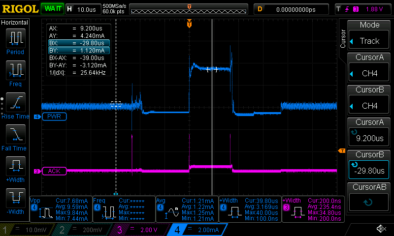
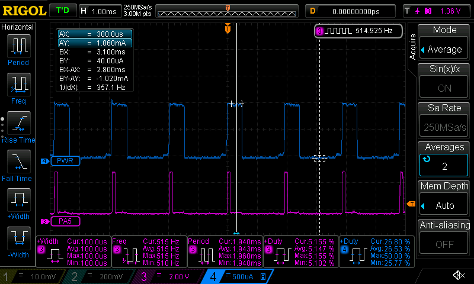
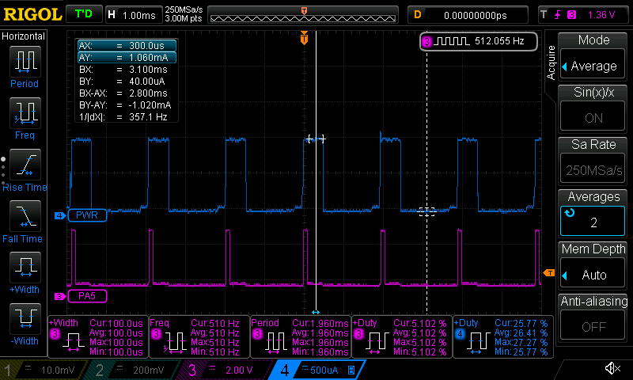
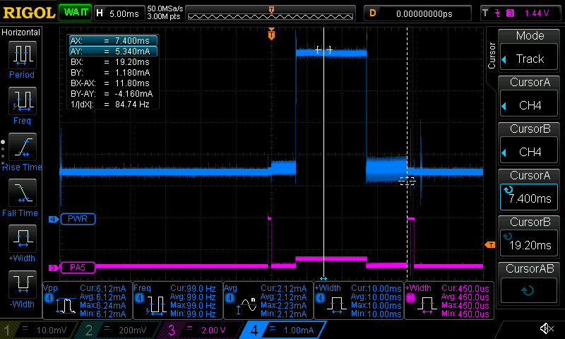

  [bloom]:https://bloom.oscillate.io/

# Current measurements

I wanted to learn how to measure current consumption. I got it working
in the end (provided my ammeter is correct).

I used a 100Ω resistor as a "shunt resistor". It gives me good enough
accuracy readings I think: My scope likes ranges in 10s of
millivolts. That yields 100µA which I think makes sense. A larger
resistor would allow higher accuracy, but would also influence the
circuitry under test more.

I set the probe scale on my scope to 0.01X and the units to
`[A]`. This means I can read off the current directly in the display -
very nice feature! I don't know how/if the scope division scale affect
the readings or if it's just for display. My actual probe is set to
1X.

## Changing the core clock frequency

This little snippet lets me see:

- current consumption at 4Mhz
- current consumption at 24Mhz
- how long it takes the device to change the core clock frequency.

```C
  while (1) {
    _delay_ms(1000);

    PA5_set_level(1);    PA5_set_level(0);
    
    ccp_write_io((void*)&(CLKCTRL.OSCHFCTRLA),CLKCTRL_FREQSEL_24M_gc);

    PA5_set_level(1);    PA5_set_level(0);

    _delay_us(100); // OBS! much shorter than 100µs!!
    
    PA5_set_level(1);    PA5_set_level(0);
    ccp_write_io((void*)&(CLKCTRL.OSCHFCTRLA),CLKCTRL_FREQSEL_4M_gc);
  }
```

`ACK` below is `PA5`. Here, we're looking at 3 "`ACKS`":

1. 24Mhz mode initializing
2. 24Mhz mode initialized
3. back to 4Mhz mode 

Note that `_delay_us` isn't aware of our new clock frequency and will
thus not delay long enough.

Also, note that my programmer (Atmel-ICE) produces a lot of noise and
distorts the current measurements. I keep it disconnected during
testing.

VCC is 3V.



These measurements tell us we're consuming `1.1mA` at 4Mhz and `4.2mA`
in 24Mhz. That is nice because they seem to agree with the datasheets
of `1.0mA` in 4Mhz and `4.1mA` in 24Mhz power consumtion under 3V.

They also claim it takes the AVR128DB28 about `23µs` to go from 4Mhz
at 24Mhz.

The datasheets also recommend connecting a `1µF` capacitor across all
power sources. I used a `10nF` instead because this affects the
measurements.

## Power consumption during sleep

I've experimented with putting AVR devices in sleep mode several
times: for the ATMega328 and ATTiny85. Then, I used the Watchdog Timer
to trigger periodic interrupt to wake the CPU back up. It seems the
AVR128 can't use the WDT like that - the WDT will always reset the
device. Luckily, there's a PIT on the RTC that the datasheet says can
be used for the same purpose.

However, I struggled to get this working! I spent many hours trying to
find out why my `RTC_PIT_vect` interrupt wouldn't trigger, and why it
wouldn't return from power-down sleep mode. In the end I gave up and
went to sleep. The next day it just worked. Maybe I needed a hardware
power reset?

Part of the problem were the BOOTSIZE fuse settings. I had changed
these during my writing-to-flash experiments. I haven't been able to
get interrupts working while `BOOTSIZE ≠ 0`. Something I'll have to
get back to.

After finally getting the `PIT` working, I realized it's pretty
inaccurate:



My scope's counter tells me it's running at `514.925Hz`. I assume
that's fairly accurate. Unfortunately, it should be running at exactly
`512Hz`. By the way, I'm using this code to produce that signal:

```C
#define ON() PA5_set_level(1);
#define OFF() PA5_set_level(0);

volatile uint8_t mark = 0;

ISR(RTC_PIT_vect) {
  mark = 1;
  RTC.PITINTFLAGS = RTC_PI_bm;
}

void RTC_0_init() {

  while (RTC.STATUS > 0) { }
  RTC.CLKSEL = RTC_CLKSEL_XOSC32K_gc;

  while (RTC.PITSTATUS > 0) { }

  RTC.PITCTRLA = RTC_PERIOD_CYC64_gc
    | 1 << RTC_PITEN_bp;

  RTC.PITINTCTRL = 1 << RTC_PI_bp;
}

int main(void) {
  atmel_start_init();
  RTC_0_init();

  PA5_set_dir(PORT_DIR_OUT);
  PA5_set_pull_mode(PORT_PULL_OFF);

  SLPCTRL_set_sleep_mode(SLPCTRL_SMODE_PDOWN_gc);

  while (1) {
    if(mark == 0) {
      ON(); _delay_us(100); OFF(); _delay_us(100);
      ON(); _delay_us(100); OFF(); _delay_us(400);
    }
    else {
      ON(); _delay_us(100); OFF(); _delay_us(400);
    }
    sleep_cpu();
  }
}
```

There's only 1 pulse, so `mark` has been set by `RTC_PIT_vect` which
is good. I tried to change `RTC.CALIB` to tune the internal
oscillator, but it seems to have no effect¹. To double-check that my
I'm doing this correctly, I also tried with an external `32.768kHz`
crystal. Now `clkctrl.c` contains this bit to configure this:

> Edit¹: I forgot to set `RTC.CTRLA`'s CORREN bit. The frequency is
> still rather unstable, however. Probably best to stick to external
> crystals for these things. They cost nothing and don't require
> anything else (except two pins).

```C
  ccp_write_io((void*)&(CLKCTRL.XOSC32KCTRLA),CLKCTRL_CSUT_1K_gc /* startup time */
               | 1 << CLKCTRL_ENABLE_bp 
               | 1 << CLKCTRL_RUNSTDBY_bp /* Run standby: disabled */
               | 0 << CLKCTRL_SEL_bp /* crystal / clock */
               | 1 << CLKCTRL_LPMODE_bp /* Low-Power Mode: disabled */);
```

And `RTC_0_init` changes `RTC.CLKSEL` from `RTC_CLKSEL_OSC32K_gc` to
`RTC_CLKSEL_XOSC32K_gc`. With that in place, I get `512.055Hz` which
is pretty good.



I guess that explains why all blog posts I read use an external
crystal. The datasheets also do mention that "low-power before
accuracy", so I guess this isn't all that surprising. It would still
be nice to not have to use an external clock crystal. I could come
back to this and re-try `RTC.CALIB`.

Anyway, with all that out of the way, let's look at the current. Going
into sleep mode, the device seems to go from around `1mA` to `40µA` -
but that's in the low end of what my setup is able to measure. With my
`100Ω` shunt resistor, `10µA` will yield a `1mV` readout on my probe -
which is basically the resolution of my scope anyway. So I'm not going
to be able to measure the datasheet claims of around `1.4µA` in this
setting (`700nA` in power-down mode, plus another `700nA` for the
RTC). My handheld ammeter tells me `2µA` so I guess they're right :-)

Edit: I tried with a `1000Ω` shunt resist and I'm still not able to
measure such low currents. The readings change as I change my scale
and all sorts of surprises.

There seems to be a slight increase in power consumption just before
our code continues to run, approximately `30µs` startup time. The
datasheet says that should be `100µs` from power-down and `24µs` from
standby (section 39.5.1.1). I'm pretty sure I'm seeing 24 and not 100,
so I wonder why that's quicker than expected. I'm doing
`SLPCTRL_set_sleep_mode(SLPCTRL_SMODE_PDOWN_gc)` so that should be
pretty unambiguous. Strange.

Note that I'm cheating a little bit with my "average" probe
setting. It gives me less noise so it's nice for presentation. I don't
know exactly how this affects my readings.

## Power consumtion during flash write

This was much harder than I thought. start.atmel.com's
`nvmctrl_basic_example.c` takes you quite far but not quite
there. This code snippet does not take into the flash regions into
account, and you have to read the datasheet thoroughly. Make sure you
set the BOOTSIZE FUSE and put all the `FLASH_0_..` functions in this
section. The default setup will just give you NVM_ERROR as you're
trying to write to the same flash section as the one that's executing.
The datasheets makes this quite clear:

> For security reasons, it is not possible to write to the section of
> Flash the code is currently executing from.

I made my BOOTSIZE half of the flash like this:

    pymcuprog -d avr128db28 write -m fuses -o 0x08 -l 128
    
That sets the BOOTSIZE FUSE to flash page 128, which is at flash byte
address 512*128 (64KiB).

Now, with that in order I managed to write a single byte to flash and
read it back:

```C
// ...
static volatile nvmctrl_status_t status;
static volatile uint8_t          rb; //           ,-- this L is _really_ important
static volatile uint32_t         myadr = 70 * 1024L;

#define ON() PA5_set_level(1);
#define OFF() PA5_set_level(0);

void hello() {
  ON();
  _delay_us(500);
  OFF();
}

int main(void) {

  atmel_start_init();

  PA5_set_dir(PORT_DIR_OUT);
  PA6_set_dir(PORT_DIR_OUT);
  
  while (1) {
    _delay_ms(1000);
    status = 30; // why can't I breakpoint _delay_ms?
    _delay_ms(1000);

    hello(); // pulse (1)
    status = FLASH_0_write_flash_byte(myadr + 0, rambuf, 1);
    hello(); // pulse (2)
    rb     = FLASH_0_read_flash_byte(myadr + 0);
    hello(); // pulse (3)
    
    if (rb != 1) { // show panic
      while(1) { ON(); _delay_ms(250); OFF(); _delay_ms(250); }
    }
  }
}
```

We're sending 3 pulses onto our oscilloscope:

1. start of test (oscilloscope trigger on falling edge)
2. done writing flash
3. done reading flash

These are shown shown in purple (`PA5`) on my oscilloscope:



Last 2 pulses are right next to each other: reading the flash is
substantially faster than writing, less than 15µs. Perhaps
unsurprising since it can even be memory-mapped to RAM.

Writing the flash takes about `19ms`. There is a peak power
consumption at `5.3mA` for that lasts `10ms`. It consumes slightly
above-average for the remainder of the time if my ammeter setup is
correct.

Note that this particular snippet pretends to write a single byte to
flash, but it doesn't. It reads the entire flash page into `rambuf`,
changes a single byte, and writes the page back. Pages are 512. So,
for a datalogging application, you probably want to buffer up 512
bytes in RAM if you can afford the risk.

Note that I'm running on the default `4Mhz`, at `3V`.

### Debugging with [bloom] and avr-gdb

I'd never really used gdb before, and I've never really used the
debugging facilities of my Atmel-ICE. I was happily surprised to find
[bloom], a bridge between avr-gdb and the Atmel-ICE
programmer/debugger hardware.

Using [bloom] and `avr-gdb` I was quickly able to find that reading
the flash worked, but writing failed. `gdb` is something I've always
wanted to learn more about.

> I also tried [pyAVRdbg](https://github.com/stemnic/pyAVRdbg) but
> couldn't get that to work.


### Inspecting reset flags (causes)

Donig this interactively with gdb is pretty neat!

```gdb
(gdb) p RSTFR           # original reset flags: UPDIRF, WDRF and PORF
$1 = 41 ')'
(gdb) p RSTFR & 1<<3    # WDRF
$3 = 8
(gdb) set RSTFR = 0     # clear all
(gdb) p RSTFR & 1<<3    # check that it worked
$4 = 0
(gdb) c
Continuing.

Breakpoint 1, main () at ../main.c:29
29	    sleep_cpu();
(gdb) p RSTFR & 1<<3   # flag set
$5 = 8
(gdb) p RSTFR          # and only that flag set
$6 = 8 '\b'
```

Also, a nice feature is that if you get a WDT timeout during
debugging, you get `process aborted with signal` in you gdb session.
