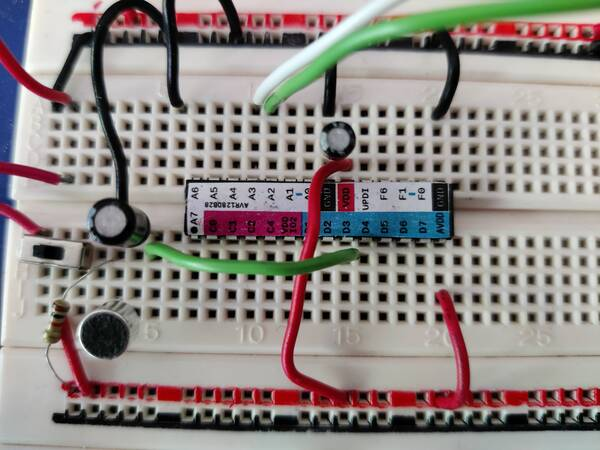

# Personal projects

Instead of littering github with a variety of low-quality "backup"
repos, I though I'd create only one and use different branches.

This isn't really intended to be useful to the public. You can browse
through the different experiments by looking at the different branches
in this repository.

## Briefly about my preferences

For some reason, I feel better about myself when I can play with
microcontrollers without a breakout board. That's why I'm stuck with
DIP chips, which is pretty restrictive. However, I've come to like the
[AVR128 family](https://www.microchip.com/en-us/product/AVR128DB28) of
devices as these are available in DIP packages. They also use a single
pin for debugging and programming (UPDI) which is much nicer than
their older siblings, ATMega328 and friends, ICSP interface which
typically requires 4 or 6 pins.

I own a Atmel ICE programmer/debugger and my Makefiles here have
probably hardcoded that one.

I like to use the editor I've spent time learning and don't want to
use a proprietary IDE, so I tend to not use MPLAB or these things. As
it turns out, I can use [bloom](https://bloom.oscillate.io/) with
`gdb` to debug in my familiar environment.

## Pinout sticker

I like to print [this](avr128db28%20pinout%20sticker.svg) out and glue
it to my chips. This helps tremendously as I'm connecting things on
the breadboard.

