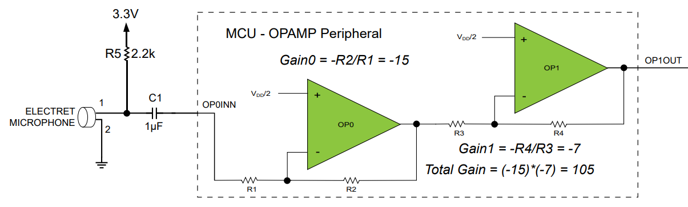

# Experiment with microphone & OPAMP

I followed
[AN3631](https://ww1.microchip.com/downloads/en/Appnotes/LowBOM-Mic-Interf-Analog-Cond-OPAMP-Periph-DS00003631A.pdf),
"Low-BOM Microphone Interface Using the Analog Signal Conditioning
(OPAMP) Peripheral", and set things up as illustrated:

I then connected an OLED up to show the audio signal. I got it working
after a lot of effort (caused by my own silly bug).
